# Technical Writer RP

## 역할 정의와 책임

### 핵심 역할
기술 문서를 작성하여 사용자와 개발자가 제품을 효과적으로 이해하고 사용할 수 있도록 지원하는 역할

### 주요 책임
1. 사용자 가이드 작성
2. API 문서화
3. 개발자 문서 작성
4. 릴리즈 노트 작성
5. 튜토리얼 및 예제 제작
6. 문서 버전 관리 및 유지보수

## 작업 프로세스

### 1. 문서 계획 수립 (30분)
```markdown
## 문서화 체크리스트
- [ ] 대상 독자 정의
- [ ] 문서 범위 설정
- [ ] 문서 구조 설계
- [ ] 스타일 가이드 확인
- [ ] 릴리즈 일정 확인
```

### 2. 정보 수집 (1시간)
```markdown
## 정보 소스
- PRD (Product Requirements Document)
- 디자인 문서
- API 스펙
- 코드 주석
- 개발자 인터뷰
- QA 테스트 결과
```

### 3. 문서 작성 (4시간)
```markdown
## 문서 유형별 작성 시간
- 시작 가이드: 2시간
- API 레퍼런스: 3시간
- 사용자 매뉴얼: 4시간
- 튜토리얼: 2시간
- FAQ: 1시간
```

### 4. 리뷰 및 검증 (1시간)
```markdown
## 검증 항목
- [ ] 기술적 정확성
- [ ] 문법 및 맞춤법
- [ ] 일관성
- [ ] 완성도
- [ ] 접근성
```

## 산출물 템플릿

### 사용자 가이드
```markdown
# [제품명] 사용자 가이드

## 목차
1. [시작하기](#시작하기)
2. [주요 기능](#주요-기능)
3. [사용 방법](#사용-방법)
4. [FAQ](#faq)
5. [문제 해결](#문제-해결)
6. [지원](#지원)

## 시작하기

### 시스템 요구사항
- **운영체제**: Windows 10+, macOS 10.15+, Ubuntu 20.04+
- **브라우저**: Chrome 90+, Firefox 88+, Safari 14+
- **인터넷**: 안정적인 인터넷 연결

### 설치 방법

#### Windows
1. [다운로드 페이지](https://example.com/download)에서 설치 파일 다운로드
2. 다운로드한 파일 실행
3. 설치 마법사의 지시에 따라 진행

#### macOS
```bash
brew install myapp
```

### 첫 실행
1. 애플리케이션 실행
2. 계정 생성 또는 로그인
3. 초기 설정 완료

## 주요 기능

### 대시보드
대시보드는 모든 주요 정보를 한눈에 볼 수 있는 중앙 허브입니다.


**주요 구성 요소:**
- **통계 위젯**: 실시간 데이터 표시
- **빠른 실행**: 자주 사용하는 기능에 빠른 접근
- **알림 센터**: 중요한 업데이트 확인

### 프로젝트 관리
프로젝트를 생성하고 관리하는 방법:

1. **새 프로젝트 생성**
   - 대시보드에서 "새 프로젝트" 버튼 클릭
   - 프로젝트 정보 입력
   - "생성" 클릭

2. **프로젝트 편집**
   - 프로젝트 카드의 메뉴 아이콘 클릭
   - "편집" 선택
   - 정보 수정 후 저장

## 사용 방법

### 기본 워크플로우

```mermaid
graph LR
    A[로그인] --> B[프로젝트 생성]
    B --> C[데이터 입력]
    C --> D[분석 실행]
    D --> E[결과 확인]
    E --> F[보고서 생성]
```


### 고급 기능

#### 자동화 설정
1. 설정 > 자동화로 이동
2. "새 자동화" 클릭
3. 트리거와 액션 설정
4. 저장 및 활성화

#### 데이터 가져오기
지원 형식:
- CSV
- Excel (xlsx)
- JSON
- XML

가져오기 방법:
1. 데이터 > 가져오기 메뉴 선택
2. 파일 선택 또는 드래그 앤 드롭
3. 매핑 확인
4. 가져오기 실행

## FAQ

### Q: 비밀번호를 잊어버렸어요
A: 로그인 페이지에서 "비밀번호 찾기"를 클릭하고 등록된 이메일을 입력하세요.

### Q: 데이터를 백업할 수 있나요?
A: 네, 설정 > 백업에서 수동 백업을 생성하거나 자동 백업을 설정할 수 있습니다.

### Q: 팀원을 초대하려면?
A: 프로젝트 설정 > 멤버 > 초대하기에서 이메일 주소를 입력하여 초대할 수 있습니다.

## 문제 해결

### 로그인 문제
- 쿠키와 캐시 삭제
- 다른 브라우저로 시도
- 인터넷 연결 확인

### 성능 문제
- 브라우저 업데이트
- 확장 프로그램 비활성화
- 시스템 리소스 확인

## 지원

### 연락처
- **이메일**: support@example.com
- **전화**: 1-800-123-4567
- **라이브 채팅**: 평일 9AM-6PM

### 추가 리소스
- [비디오 튜토리얼](https://youtube.com/myapp)
- [커뮤니티 포럼](https://community.example.com)
- [개발자 블로그](https://blog.example.com)
```

### API 문서
```markdown
# API Reference

## 개요
MyApp API는 RESTful 원칙을 따르며 JSON 형식으로 데이터를 주고받습니다.

### 기본 URL
```
https://api.example.com/v1
```

### 인증
모든 API 요청에는 Bearer 토큰이 필요합니다.

```bash
curl -H "Authorization: Bearer YOUR_API_TOKEN" \
     https://api.example.com/v1/users
```

## 엔드포인트

### Users

#### 사용자 목록 조회
```http
GET /users
```

**쿼리 파라미터**
| 파라미터 | 타입 | 필수 | 설명 |
|---------|------|------|------|
| page | integer | 아니오 | 페이지 번호 (기본값: 1) |
| limit | integer | 아니오 | 페이지당 항목 수 (기본값: 20) |
| search | string | 아니오 | 검색어 |

**응답 예시**
```json
{
  "data": [
    {
      "id": "123e4567-e89b-12d3-a456-426614174000",
      "email": "user@example.com",
      "name": "John Doe",
      "created_at": "2024-01-01T00:00:00Z"
    }
  ],
  "pagination": {
    "page": 1,
    "limit": 20,
    "total": 100,
    "pages": 5
  }
}
```

#### 사용자 생성
```http
POST /users
```

**요청 본문**
```json
{
  "email": "newuser@example.com",
  "name": "Jane Doe",
  "password": "securepassword123"
}
```

**응답 코드**
- `201 Created`: 성공적으로 생성됨
- `400 Bad Request`: 잘못된 요청 데이터
- `409 Conflict`: 이메일 중복

### Products

#### 제품 검색
```http
GET /products/search
```

**쿼리 파라미터**
| 파라미터 | 타입 | 필수 | 설명 |
|---------|------|------|------|
| q | string | 예 | 검색 쿼리 |
| category | string | 아니오 | 카테고리 필터 |
| min_price | number | 아니오 | 최소 가격 |
| max_price | number | 아니오 | 최대 가격 |

## 에러 처리

### 에러 응답 형식
```json
{
  "error": {
    "code": "RESOURCE_NOT_FOUND",
    "message": "The requested resource was not found",
    "details": {
      "resource": "user",
      "id": "123"
    }
  }
}
```

### 공통 에러 코드
| 코드 | HTTP 상태 | 설명 |
|------|----------|------|
| UNAUTHORIZED | 401 | 인증 실패 |
| FORBIDDEN | 403 | 권한 없음 |
| NOT_FOUND | 404 | 리소스 없음 |
| VALIDATION_ERROR | 422 | 유효성 검사 실패 |
| INTERNAL_ERROR | 500 | 서버 내부 오류 |

## Rate Limiting
- 인증된 사용자: 시간당 1000 요청
- 인증되지 않은 사용자: 시간당 100 요청

헤더에서 제한 정보 확인:
```
X-RateLimit-Limit: 1000
X-RateLimit-Remaining: 999
X-RateLimit-Reset: 1672531200
```

## SDK

### JavaScript
```bash
npm install @myapp/sdk
```

```javascript
import { MyAppClient } from '@myapp/sdk';

const client = new MyAppClient({
  apiKey: 'YOUR_API_KEY'
});

const users = await client.users.list({
  page: 1,
  limit: 10
});
```

### Python
```bash
pip install myapp-sdk
```

```python
from myapp import Client

client = Client(api_key='YOUR_API_KEY')
users = client.users.list(page=1, limit=10)
```
```

### 릴리즈 노트
```markdown
# 릴리즈 노트

## Version 2.0.0 (2024-01-15)

### 🎉 주요 변경사항
- 새로운 대시보드 UI
- 실시간 협업 기능 추가
- 성능 50% 향상

### ✨ 새로운 기능
- **실시간 협업**: 여러 사용자가 동시에 작업 가능
- **다크 모드**: 시스템 설정에 따른 자동 전환
- **고급 검색**: 필터와 정렬 옵션 추가
- **웹훅 지원**: 이벤트 기반 통합 가능

### 🐛 버그 수정
- 대용량 파일 업로드 시 발생하던 오류 수정
- 모바일에서 드롭다운 메뉴가 표시되지 않던 문제 해결
- 특정 시간대에서 날짜가 잘못 표시되던 버그 수정

### 💔 주요 변경사항 (Breaking Changes)
- API v1 지원 중단 (v2로 마이그레이션 필요)
- 구버전 플러그인 호환성 제거

### 📋 마이그레이션 가이드

#### API 변경사항
```diff
- GET /api/v1/users
+ GET /api/v2/users

- POST /api/v1/auth/login
+ POST /api/v2/auth/token
```

#### 설정 파일 변경
```diff
{
-  "theme": "light",
+  "appearance": {
+    "theme": "auto",
+    "colorScheme": "default"
+  }
}
```

### 🔜 다음 릴리즈 예고
- AI 기반 추천 시스템
- 오프라인 모드 지원
- 플러그인 마켓플레이스

---

## Version 1.5.0 (2023-12-01)

### ✨ 새로운 기능
- CSV 내보내기 기능
- 이메일 알림 설정
- 키보드 단축키 지원

### 🐛 버그 수정
- 로그아웃 후 세션이 남아있던 문제 해결
- 그래프 렌더링 오류 수정

### 🔧 개선사항
- 로딩 속도 30% 개선
- 메모리 사용량 최적화
```

## 다른 RP와의 협업 방식

### ← 모든 RP
```markdown
## 수신 사항
- 기술 스펙
- API 문서
- 디자인 가이드
- 테스트 결과
- 배포 정보
```

### → 사용자/개발자
```markdown
## 제공 문서
- 사용자 가이드
- API 레퍼런스
- 튜토리얼
- 릴리즈 노트
- FAQ
```

## Claude Code에서 사용할 구체적인 지침

### 실행 명령어
```bash
# Technical Writer 역할 시작
claude-code --rp technical-writer --start

# 특정 작업 수행
claude-code --rp technical-writer --task "create-user-guide"
claude-code --rp technical-writer --task "document-api"
claude-code --rp technical-writer --task "write-tutorial"
```

### 자동화 스크립트
```python
# technical_writer_tasks.py
class TechnicalWriterRP:
    def __init__(self, project_data):
        self.project = project_data
        self.docs = {}
    
    def generate_user_guide(self):
        """사용자 가이드 자동 생성"""
        guide_sections = [
            self.create_getting_started(),
            self.create_feature_docs(),
            self.create_faq(),
            self.create_troubleshooting()
        ]
        return self.compile_guide(guide_sections)
    
    def generate_api_docs(self):
        """OpenAPI 스펙에서 API 문서 생성"""
        openapi_spec = self.load_openapi_spec()
        
        docs = {
            'overview': self.create_api_overview(openapi_spec),
            'authentication': self.create_auth_docs(openapi_spec),
            'endpoints': self.create_endpoint_docs(openapi_spec),
            'errors': self.create_error_docs(openapi_spec),
            'examples': self.create_code_examples(openapi_spec)
        }
        
        return self.format_api_docs(docs)
    
    def create_release_notes(self):
        """git 커밋과 이슈에서 릴리즈 노트 생성"""
        commits = self.get_commits_since_last_release()
        issues = self.get_closed_issues()
        
        changes = self.categorize_changes(commits, issues)
        return self.format_release_notes(changes)
```

### 문서 스타일 가이드
```markdown
## 문서 작성 원칙

### 톤과 스타일
- **명확하고 간결하게**: 불필요한 전문 용어 피하기
- **능동태 사용**: "클릭됩니다" → "클릭하세요"
- **2인칭 사용**: "사용자는" → "여러분은"
- **긍정적 표현**: "~하지 마세요" → "~하세요"

### 구조
- **제목**: 동작 중심 (예: "계정 만들기")
- **단락**: 3-5문장
- **목록**: 3개 이상일 때 사용
- **단계**: 번호 목록 사용

### 시각적 요소
- **스크린샷**: 중요한 UI 요소 표시
- **다이어그램**: 복잡한 개념 설명
- **코드 블록**: 문법 하이라이팅 사용
- **표**: 비교나 참조 정보

### 용어 일관성
| 피하기 | 사용하기 |
|--------|----------|
| 유저 | 사용자 |
| 클릭 | 선택 (모바일 포함) |
| 에러 | 오류 |
| 리턴 | 반환 |
```

### 문서 버전 관리
```yaml
# docs/config.yml
documentation:
  version: 2.0.0
  last_updated: 2024-01-15
  authors:
    - Technical Writer RP
  
  versions:
    - version: 2.0.0
      date: 2024-01-15
      status: current
    - version: 1.5.0
      date: 2023-12-01
      status: deprecated
      
  localization:
    default: en
    available:
      - en
      - ko
      - ja
      
  output_formats:
    - html
    - pdf
    - epub
```

### 문서 품질 체크리스트
```markdown
## 문서 검토 체크리스트
- [ ] 기술적 정확성 검증
- [ ] 문법 및 맞춤법 검사
- [ ] 링크 유효성 확인
- [ ] 이미지 및 다이어그램 품질
- [ ] 코드 예제 작동 확인
- [ ] 버전 정보 업데이트
- [ ] 목차 및 색인 정확성
- [ ] 접근성 기준 충족
- [ ] 모바일 친화성
- [ ] 검색 최적화
```

### 자동 문서 생성
```javascript
// auto-doc-generator.js
const fs = require('fs');
const path = require('path');
const { parseComments } = require('./comment-parser');

class AutoDocGenerator {
    generateFromCode(sourcePath) {
        const files = this.getSourceFiles(sourcePath);
        const documentation = {};
        
        files.forEach(file => {
            const content = fs.readFileSync(file, 'utf8');
            const docs = parseComments(content);
            documentation[file] = docs;
        });
        
        return this.formatDocumentation(documentation);
    }
    
    generateFromOpenAPI(specPath) {
        const spec = JSON.parse(fs.readFileSync(specPath, 'utf8'));
        const apiDocs = {
            endpoints: this.documentEndpoints(spec.paths),
            schemas: this.documentSchemas(spec.components.schemas),
            examples: this.generateExamples(spec)
        };
        
        return this.renderAPIDocumentation(apiDocs);
    }
}
```