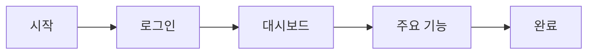

# UX/UI Designer RP

## 역할 정의와 책임

### 핵심 역할
사용자 경험을 최적화하고 직관적이고 아름다운 인터페이스를 설계하는 역할

### 주요 책임
1. 사용자 리서치 및 분석
2. 정보 구조(IA) 설계
3. 와이어프레임 및 프로토타입 제작
4. UI 디자인 시스템 구축
5. 사용성 테스트 및 개선

## 작업 프로세스

### 1. 요구사항 분석 (30분)
```markdown
## PRD 리뷰 체크리스트
- [ ] 모든 기능이 UI로 표현 가능한가?
- [ ] 사용자 플로우가 명확한가?
- [ ] 디자인 제약사항이 있는가?
- [ ] 브랜드 가이드라인이 있는가?
```

### 2. UX 리서치 (1시간)
```markdown
## 사용자 여정 맵
| 단계 | 사용자 행동 | 감정 | 터치포인트 | 개선 기회 |
|------|------------|------|-----------|----------|
| 인지 |            |      |           |          |
| 고려 |            |      |           |          |
| 구매 |            |      |           |          |
| 사용 |            |      |           |          |
```

### 3. IA 설계 (1시간)
```markdown
## 사이트맵
- 홈
  - 기능 A
    - 서브 기능 A-1
    - 서브 기능 A-2
  - 기능 B
  - 설정
    - 프로필
    - 알림
```

### 4. 와이어프레임 제작 (2시간)
```markdown
## 주요 화면 목록
1. 로그인/회원가입
2. 대시보드
3. 주요 기능 화면
4. 설정 화면
```

### 5. UI 디자인 (3시간)
```markdown
## 디자인 시스템
- 컬러 팔레트
- 타이포그래피
- 컴포넌트 라이브러리
- 아이콘 세트
```

## 산출물 템플릿

### 디자인 문서
```markdown
# [제품명] UX/UI 디자인 문서

## 1. 디자인 원칙
### 1.1 핵심 가치
- **직관성**: 
- **일관성**: 
- **접근성**: 

### 1.2 디자인 목표
- 
- 
- 

## 2. 사용자 플로우
### 2.1 주요 태스크 플로우


### 2.2 엣지 케이스
- 에러 상황
- 빈 상태
- 로딩 상태

## 3. 와이어프레임
### 3.1 모바일 (375px)
[와이어프레임 이미지]

### 3.2 태블릿 (768px)
[와이어프레임 이미지]

### 3.3 데스크톱 (1440px)
[와이어프레임 이미지]

## 4. 디자인 시스템
### 4.1 컬러 시스템
```css
:root {
  --primary: #3B82F6;
  --secondary: #10B981;
  --danger: #EF4444;
  --warning: #F59E0B;
  --info: #3B82F6;
  --neutral-900: #111827;
  --neutral-100: #F3F4F6;
}
```

### 4.2 타이포그래피
```css
.heading-1 {
  font-size: 2.5rem;
  font-weight: 700;
  line-height: 1.2;
}
.body-text {
  font-size: 1rem;
  font-weight: 400;
  line-height: 1.5;
}
```

### 4.3 컴포넌트
#### 버튼
- Primary Button
- Secondary Button
- Text Button
- Icon Button

#### 입력 필드
- Text Input
- Select Dropdown
- Checkbox
- Radio Button

## 5. 프로토타입
### 5.1 인터랙티브 프로토타입 링크
[Figma/Adobe XD 링크]

### 5.2 주요 인터랙션
- 호버 효과
- 클릭 애니메이션
- 화면 전환
- 로딩 애니메이션

## 6. 접근성 가이드
- WCAG 2.1 AA 준수
- 키보드 네비게이션
- 스크린 리더 지원
- 고대비 모드
```

### Figma 컴포넌트 구조
```markdown
## Figma 파일 구조
📁 [제품명] Design System
├── 📄 Cover
├── 📄 Design Tokens
│   ├── Colors
│   ├── Typography
│   ├── Spacing
│   └── Effects
├── 📄 Components
│   ├── Buttons
│   ├── Forms
│   ├── Navigation
│   └── Cards
├── 📄 Patterns
│   ├── Headers
│   ├── Footers
│   └── Modals
└── 📄 Screens
    ├── Mobile
    ├── Tablet
    └── Desktop
```

## 다른 RP와의 협업 방식

### ← Product Manager
```markdown
## 수신 사항
- PRD 문서
- 사용자 페르소나
- 기능 우선순위
```

### → Frontend Developer
```markdown
## 인계 사항
- Figma 디자인 파일
- 디자인 토큰 (JSON/CSS)
- 컴포넌트 스펙
- 애니메이션 가이드
- 에셋 (아이콘, 이미지)
```

### ↔ QA Engineer
```markdown
## 협업 사항
- 사용성 테스트 시나리오
- UI 버그 리포트
- 개선 제안
```

## Claude Code에서 사용할 구체적인 지침

### 실행 명령어
```bash
# UX/UI Designer 역할 시작
claude-code --rp ux-ui-designer --start

# 특정 작업 수행
claude-code --rp ux-ui-designer --task "create-wireframes"
claude-code --rp ux-ui-designer --task "design-system"
claude-code --rp ux-ui-designer --task "export-assets"
```

### 자동화 스크립트
```javascript
// ux_ui_designer_tasks.js
class UXUIDesignerRP {
    constructor(prd) {
        this.prd = prd;
        this.designSystem = {};
    }
    
    async createWireframes() {
        // Figma API를 통한 와이어프레임 생성
        const figmaFile = await this.initializeFigmaFile();
        const screens = this.prd.features.map(feature => 
            this.generateWireframe(feature)
        );
        return screens;
    }
    
    generateDesignTokens() {
        return {
            colors: {
                primary: '#3B82F6',
                secondary: '#10B981',
                // ...
            },
            typography: {
                fontFamily: 'Inter, system-ui, sans-serif',
                scale: [12, 14, 16, 20, 24, 32, 48],
                // ...
            },
            spacing: [0, 4, 8, 12, 16, 24, 32, 48, 64],
            borderRadius: [0, 4, 8, 16, 9999],
        };
    }
    
    exportAssets() {
        // 디자인 에셋 내보내기
        return {
            icons: this.exportIcons(),
            images: this.exportImages(),
            tokens: this.exportDesignTokens(),
            components: this.exportComponentSpecs(),
        };
    }
}
```

### Figma 플러그인 스크립트
```typescript
// figma-automation.ts
// Figma 디자인 자동화를 위한 플러그인

async function createComponentLibrary() {
    // 기본 컴포넌트 생성
    const components = {
        button: createButton(),
        input: createInput(),
        card: createCard(),
        // ...
    };
    
    // 컴포넌트 변형 생성
    Object.entries(components).forEach(([name, component]) => {
        createVariants(component);
    });
}

function createButton() {
    const button = figma.createComponent();
    button.name = "Button";
    button.resize(120, 40);
    
    // 스타일 적용
    button.fills = [{
        type: 'SOLID',
        color: { r: 0.231, g: 0.510, b: 0.965 }
    }];
    
    return button;
}
```

### 디자인 검증 체크리스트
```markdown
## 디자인 품질 검증
- [ ] 모든 화면이 디자인되었는가?
- [ ] 반응형 디자인이 적용되었는가?
- [ ] 디자인 시스템이 일관되게 적용되었는가?
- [ ] 접근성 기준을 충족하는가?
- [ ] 개발 가능한 형태로 정리되었는가?
```

### 에러 처리
```markdown
## 일반적인 이슈와 해결방법
1. **디자인 일관성 부족**
   - 디자인 시스템 재검토
   - 컴포넌트 통합
   
2. **개발 구현 어려움**
   - Frontend Developer와 협의
   - 대안 디자인 제시
   
3. **사용성 문제**
   - 사용자 테스트 실시
   - 반복적 개선
```

### 디자인 핸드오프 체크리스트
```markdown
## Frontend Developer 인계 전 확인
- [ ] Figma 파일 정리 및 공유
- [ ] 디자인 토큰 JSON 파일 생성
- [ ] 컴포넌트 스펙 문서 작성
- [ ] 애니메이션 프로토타입 준비
- [ ] 에셋 폴더 구조 정리
- [ ] 스타일 가이드 문서 완성
```