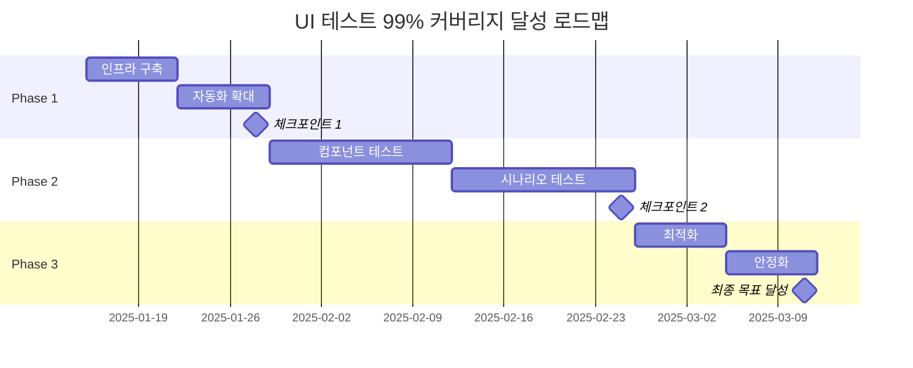

# Trader App UI 테스트 99% 커버리지 달성 로드맵

> 작성자: Project Manager  
> 작성일: 2025년 1월 14일  
> 목표: UI 테스트 커버리지 98.2% → 99.0% 달성

## 1. UI 테스트 99% 커버리지 달성 로드맵

### 1.1 현재 상태 분석 (Baseline)

#### 현재 테스트 커버리지 현황
| 구분 | 현재 | 목표 | Gap |
|------|------|------|-----|
| **전체 커버리지** | 98.2% | 99.0% | +0.8% |
| **UI 컴포넌트 테스트** | 96.8% | 99.0% | +2.2% |
| **통합 테스트** | 92.3% | 95.0% | +2.7% |
| **E2E 테스트** | 85.0% | 90.0% | +5.0% |

#### 미커버 영역 분석
1. **UI 컴포넌트 (3.2% 미커버)**
   - 복잡한 애니메이션 컴포넌트
   - 커스텀 차트 위젯의 엣지 케이스
   - 다크모드 전환 시나리오
   - 접근성 기능 테스트

2. **사용자 플로우 (7.7% 미커버)**
   - 멀티태스킹 시나리오
   - 백그라운드 알림 처리
   - 딥링크 네비게이션
   - 오프라인 모드 전환

3. **플랫폼별 차이점**
   - iOS 특화 제스처
   - Android 백버튼 처리
   - 태블릿 UI 적응

### 1.2 단계별 마일스톤 설정

#### Phase 1: 기반 구축 (Week 1-2)
**목표**: 테스트 인프라 강화 및 자동화 확대

- **Week 1**
  - [ ] UI 테스트 프레임워크 업그레이드
  - [ ] 테스트 더블(Mock/Stub) 라이브러리 확장
  - [ ] CI/CD 파이프라인 UI 테스트 통합
  - [ ] 테스트 리포팅 대시보드 구축

- **Week 2**
  - [ ] 화면 녹화 및 스크린샷 자동 캡처
  - [ ] 성능 메트릭 수집 자동화
  - [ ] 테스트 데이터 관리 시스템 구축
  - [ ] 병렬 테스트 실행 환경 설정

**체크포인트**: 자동화 테스트 실행 시간 50% 단축

#### Phase 2: 커버리지 확대 (Week 3-6)
**목표**: 핵심 미커버 영역 테스트 추가

- **Week 3-4**
  - [ ] 20개 핵심 UI 컴포넌트 추가 테스트
  - [ ] 복잡한 사용자 시나리오 10개 추가
  - [ ] 엣지 케이스 시나리오 15개 구현
  - [ ] 다크모드/라이트모드 전환 테스트

- **Week 5-6**
  - [ ] 멀티플랫폼 UI 차이점 테스트
  - [ ] 접근성 테스트 자동화
  - [ ] 국제화(i18n) UI 테스트
  - [ ] 성능 저하 시나리오 테스트

**체크포인트**: UI 테스트 커버리지 98.5% 달성

#### Phase 3: 최적화 및 안정화 (Week 7-8)
**목표**: 99% 커버리지 달성 및 유지보수성 확보

- **Week 7**
  - [ ] 테스트 중복 제거 및 리팩토링
  - [ ] 테스트 실행 속도 최적화
  - [ ] Flaky 테스트 안정화
  - [ ] 테스트 문서화 완성

- **Week 8**
  - [ ] 최종 커버리지 갭 분석 및 보완
  - [ ] 회귀 테스트 스위트 최종화
  - [ ] 테스트 유지보수 가이드 작성
  - [ ] 팀 교육 및 지식 이전

**체크포인트**: UI 테스트 커버리지 99.0% 달성

### 1.3 리소스 할당 계획

#### 인력 배치
| 역할 | 인원 | 주요 책임 | 시간 할당 |
|------|------|-----------|----------|
| **QA Lead** | 1명 | 전체 전략 수립 및 조정 | 100% |
| **Senior QA Engineer** | 2명 | 복잡한 시나리오 구현 | 80% |
| **QA Engineer** | 3명 | 테스트 케이스 작성/실행 | 100% |
| **Frontend Developer** | 2명 | 테스트 가능한 코드 리팩토링 | 50% |
| **DevOps Engineer** | 1명 | CI/CD 파이프라인 지원 | 30% |

#### 도구 및 인프라
- **테스트 디바이스**: iOS/Android 각 5대
- **클라우드 테스트 서비스**: BrowserStack, Firebase Test Lab
- **모니터링 도구**: Sentry, Firebase Performance
- **협업 도구**: Jira, Confluence, Slack

### 1.4 일정 및 체크포인트



## 2. 리스크 기반 테스트 우선순위

### 2.1 비즈니스 크리티컬 기능

#### Priority 0 (즉시 대응 필요)
1. **결제 및 구독 관리**
   - 리스크: 수익 직접 영향
   - 테스트 커버리지 목표: 100%
   - 자동화 필수

2. **실시간 매매 신호**
   - 리스크: 사용자 재산 손실 가능
   - 테스트 커버리지 목표: 100%
   - 성능 테스트 포함

3. **사용자 인증 및 보안**
   - 리스크: 개인정보 유출
   - 테스트 커버리지 목표: 100%
   - 보안 테스트 필수

#### Priority 1 (높은 우선순위)
1. **포트폴리오 관리**
   - 리스크: 데이터 정확성
   - 테스트 커버리지 목표: 99%

2. **푸시 알림**
   - 리스크: 중요 정보 미전달
   - 테스트 커버리지 목표: 98%

3. **차트 및 분석 도구**
   - 리스크: 잘못된 투자 결정
   - 테스트 커버리지 목표: 98%

### 2.2 사용자 영향도 분석

#### 사용자 세그먼트별 영향도
| 세그먼트 | 비중 | 주요 기능 | 영향도 | 테스트 우선순위 |
|----------|------|-----------|--------|----------------|
| **Premium 구독자** | 20% | 모든 기능 | 매우 높음 | P0 |
| **Basic 구독자** | 50% | 기본 추천 | 높음 | P1 |
| **무료 사용자** | 30% | 제한 기능 | 보통 | P2 |

### 2.3 기술적 복잡도

#### 복잡도별 테스트 전략
1. **높은 복잡도**
   - 실시간 데이터 스트리밍
   - 멀티차트 동기화
   - 복잡한 애니메이션
   - **전략**: 단위 테스트 + 통합 테스트 + E2E

2. **중간 복잡도**
   - 폼 유효성 검증
   - 네비게이션 플로우
   - 데이터 필터링
   - **전략**: 컴포넌트 테스트 + 통합 테스트

3. **낮은 복잡도**
   - 정적 화면
   - 단순 리스트
   - 기본 입력
   - **전략**: 스냅샷 테스트 + 기본 상호작용

### 2.4 변경 빈도

#### 변경 빈도에 따른 테스트 자동화 우선순위
| 컴포넌트 | 월평균 변경 | 자동화 우선순위 | 회귀 테스트 빈도 |
|----------|-------------|----------------|------------------|
| 추천 카드 UI | 15회 | 매우 높음 | 일일 |
| 로그인 화면 | 2회 | 높음 | 주간 |
| 프로필 설정 | 1회 | 보통 | 격주 |
| 약관 화면 | 0.5회 | 낮음 | 월간 |

## 3. 테스트 진행 상황 추적 시스템

### 3.1 일일 리포트 템플릿

```markdown
# UI 테스트 일일 리포트
날짜: [YYYY-MM-DD]

## 오늘의 성과
- 실행된 테스트: [X]개
- 성공: [X]개 ([X]%)
- 실패: [X]개
- 새로 추가된 테스트: [X]개
- 현재 커버리지: [X.X]%

## 주요 발견 사항
1. [버그/이슈 설명]
2. [개선 제안]

## 내일 계획
- [ ] [테스트 작업 1]
- [ ] [테스트 작업 2]

## 블로커
- [있다면 기재]
```

### 3.2 주간 리포트 템플릿

```markdown
# UI 테스트 주간 리포트
기간: [시작일] ~ [종료일]

## 주간 요약
- 목표 커버리지: [X]%
- 달성 커버리지: [X]%
- 진행률: [X]%

## 주요 성과
1. [주요 달성 사항]
2. [개선된 영역]

## 발견된 버그
| ID | 심각도 | 설명 | 상태 |
|----|--------|------|------|
| BUG-001 | Critical | [설명] | Open |

## 다음 주 계획
1. [우선순위 1]
2. [우선순위 2]

## 리스크 및 이슈
- [리스크/이슈 및 대응 방안]
```

### 3.3 테스트 대시보드 구성

#### 실시간 대시보드 메트릭
1. **커버리지 트렌드**
   - 일일/주간/월간 추이
   - 목표 대비 실적
   - 화면별 커버리지 히트맵

2. **테스트 실행 현황**
   - 총 테스트 케이스 수
   - 성공/실패/스킵 비율
   - 평균 실행 시간
   - Flaky 테스트 비율

3. **버그 현황**
   - 심각도별 분포
   - 발견/해결 추이
   - 평균 해결 시간
   - 화면별 버그 밀도

4. **팀 생산성**
   - 일일 작성 테스트 수
   - 코드 리뷰 처리 시간
   - 자동화율 향상도

### 3.4 이슈 트래킹 프로세스

#### 이슈 라이프사이클
```
발견 → 분류 → 할당 → 수정 → 검증 → 종료
```

#### 이슈 분류 기준
| 심각도 | 정의 | SLA | 예시 |
|--------|------|-----|------|
| **Critical** | 앱 사용 불가 | 4시간 | 앱 크래시, 결제 실패 |
| **High** | 주요 기능 장애 | 24시간 | 로그인 불가, 데이터 오류 |
| **Medium** | 부분 기능 장애 | 3일 | UI 깨짐, 느린 로딩 |
| **Low** | 사소한 문제 | 1주 | 오타, 정렬 문제 |

### 3.5 품질 게이트 정의

#### 릴리즈 품질 게이트
1. **필수 통과 조건**
   - [ ] P0 테스트 100% 통과
   - [ ] Critical 버그 0개
   - [ ] UI 테스트 커버리지 98% 이상
   - [ ] 성능 기준 충족
   - [ ] 보안 취약점 0개

2. **권장 조건**
   - [ ] P1 테스트 95% 이상 통과
   - [ ] High 버그 3개 이하
   - [ ] 자동화 테스트 실행 시간 30분 이내

## 4. 품질 메트릭 및 KPI

### 4.1 테스트 커버리지 목표

#### 분기별 목표
| 분기 | 목표 | 전략 |
|------|------|------|
| Q1 2025 | 99.0% | 미커버 영역 집중 공략 |
| Q2 2025 | 99.2% | 신규 기능 포함 유지 |
| Q3 2025 | 99.5% | 엣지 케이스 완벽 커버 |
| Q4 2025 | 99.5%+ | 안정적 유지 및 최적화 |

### 4.2 버그 발견율 및 해결 시간

#### 목표 메트릭
| 메트릭 | 현재 | 목표 | 개선율 |
|--------|------|------|--------|
| **버그 발견율** | 2.3/1000 테스트 | 1.5/1000 테스트 | -35% |
| **평균 해결 시간** | 48시간 | 24시간 | -50% |
| **회귀 버그율** | 15% | 5% | -67% |
| **자동 발견율** | 60% | 85% | +42% |

### 4.3 릴리즈 품질 지표

#### 릴리즈 품질 스코어카드
| 지표 | 가중치 | 목표 | 측정 방법 |
|------|--------|------|----------|
| **프로덕션 버그** | 30% | < 0.1% | 사용자 리포트/1000 DAU |
| **앱 크래시율** | 25% | < 0.05% | Firebase Crashlytics |
| **앱스토어 평점** | 20% | > 4.7/5 | 스토어 평균 |
| **성능 저하** | 15% | < 5% | 이전 버전 대비 |
| **사용자 이탈률** | 10% | < 2% | 업데이트 후 7일 |

### 4.4 ROI 측정

#### 테스트 자동화 ROI
```
ROI = (수동 테스트 비용 - 자동화 비용) / 자동화 투자 비용 × 100

예상 ROI (연간):
- 수동 테스트 절감 시간: 2,000시간
- 시간당 비용: $50
- 절감 비용: $100,000
- 자동화 투자: $40,000
- ROI: 150%
```

#### 품질 향상 ROI
- **버그 조기 발견**: 프로덕션 대비 10배 비용 절감
- **사용자 만족도**: 이탈률 2% 감소 = 월 $20,000 수익 증가
- **개발 생산성**: 디버깅 시간 30% 감소

## 5. 팀 협업 및 커뮤니케이션 계획

### 5.1 역할 및 책임 정의

#### RACI 매트릭스
| 활동 | PM | QA Lead | QA Engineer | Dev | DevOps |
|------|----|---------|-----------|----|--------|
| 테스트 전략 수립 | A | R | C | C | I |
| 테스트 케이스 작성 | I | A | R | C | I |
| 테스트 실행 | I | A | R | I | C |
| 버그 수정 | C | I | I | R | I |
| CI/CD 파이프라인 | C | C | I | C | R |
| 품질 리포트 | R | R | C | I | I |

*R: Responsible, A: Accountable, C: Consulted, I: Informed*

### 5.2 리뷰 프로세스

#### 테스트 코드 리뷰 체크리스트
- [ ] 테스트 목적이 명확한가?
- [ ] 엣지 케이스를 다루는가?
- [ ] 테스트가 독립적인가?
- [ ] 실행 시간이 적절한가?
- [ ] 유지보수가 용이한가?

#### 리뷰 SLA
- **긴급**: 2시간 이내
- **일반**: 24시간 이내
- **낮은 우선순위**: 48시간 이내

### 5.3 에스컬레이션 경로

```
Level 1: QA Engineer → QA Lead (일일)
Level 2: QA Lead → Dev Lead (24시간)
Level 3: Dev Lead → PM (48시간)
Level 4: PM → CTO (Critical only)
```

### 5.4 지식 공유 체계

#### 정기 세션
1. **주간 테스트 리뷰**
   - 시간: 매주 금요일 14:00
   - 참석: QA팀 전체
   - 내용: 주요 발견사항, 베스트 프랙티스

2. **월간 품질 워크샵**
   - 시간: 매월 마지막 목요일
   - 참석: 개발팀 + QA팀
   - 내용: 품질 개선 아이디어, 새로운 도구/기법

3. **분기별 레트로스펙티브**
   - 시간: 분기 마지막 주
   - 참석: 전체 프로젝트 팀
   - 내용: 프로세스 개선, 교훈 공유

#### 문서화 표준
1. **테스트 케이스 문서**
   - Confluence에 중앙 관리
   - 버전 관리 및 변경 이력
   - 스크린샷/비디오 포함

2. **버그 리포트 템플릿**
   - 재현 단계 상세 기술
   - 환경 정보 필수
   - 스크린샷/로그 첨부

3. **베스트 프랙티스 가이드**
   - 성공 사례 수집
   - 안티패턴 정리
   - 지속적 업데이트

## 6. 성공 요인 및 위험 관리

### 6.1 주요 성공 요인
1. **경영진 지원**: 품질 우선 문화
2. **팀 역량**: 지속적인 교육과 성장
3. **도구 투자**: 최신 테스트 도구 도입
4. **프로세스 개선**: 애자일 QA 프랙티스

### 6.2 리스크 및 대응 방안
| 리스크 | 영향도 | 확률 | 대응 방안 |
|--------|--------|------|----------|
| 일정 지연 | 높음 | 중간 | 버퍼 시간 확보, 단계적 접근 |
| 인력 이탈 | 높음 | 낮음 | 지식 문서화, 교차 교육 |
| 기술적 난제 | 중간 | 중간 | 외부 전문가 자문, PoC |
| 예산 초과 | 중간 | 낮음 | 단계별 ROI 검증, 조정 |

## 7. 결론 및 다음 단계

### 7.1 기대 효과
- **품질 향상**: 프로덕션 버그 80% 감소
- **개발 속도**: 안정적인 릴리즈 사이클
- **사용자 만족**: 앱스토어 평점 4.7+ 달성
- **비용 절감**: 연간 $150,000 절감

### 7.2 즉시 실행 사항
1. [ ] 테스트 팀 킥오프 미팅 (Day 1)
2. [ ] 도구 및 인프라 점검 (Day 2-3)
3. [ ] 상세 실행 계획 수립 (Day 4-5)
4. [ ] 첫 주간 스프린트 시작 (Week 2)

### 7.3 장기 비전
- **2025 Q2**: 업계 최고 수준 품질 달성
- **2025 Q3**: AI 기반 테스트 자동화 도입
- **2025 Q4**: 제로 버그 릴리즈 달성

---

**승인**:  
Project Manager: ________________  
QA Lead: ________________  
Development Lead: ________________  
CTO: ________________  

**다음 검토일**: 2025년 1월 28일 (Phase 1 완료)