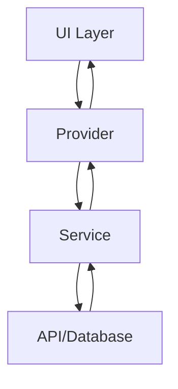

# 🛠 Trader App 개발자 가이드

## 목차
1. [프로젝트 개요](#프로젝트-개요)
2. [개발 환경 설정](#개발-환경-설정)
3. [프로젝트 구조](#프로젝트-구조)
4. [아키텍처](#아키텍처)
5. [코딩 컨벤션](#코딩-컨벤션)
6. [주요 기능 구현](#주요-기능-구현)
7. [테스트](#테스트)
8. [빌드 및 배포](#빌드-및-배포)
9. [기여 가이드](#기여-가이드)

## 프로젝트 개요

Trader App은 Flutter 프레임워크를 사용하여 개발된 크로스 플랫폼 모바일 애플리케이션입니다. 전설적인 트레이더들의 투자 전략을 AI로 분석하여 사용자에게 매매 신호를 제공합니다.

### 기술 스택
- **Frontend**: Flutter 3.0+, Dart 3.0+
- **State Management**: Riverpod 2.0
- **Backend**: Supabase (PostgreSQL, Auth, Realtime)
- **Charts**: fl_chart
- **네트워킹**: dio
- **로컬 스토리지**: shared_preferences, sqflite

## 개발 환경 설정

### 필수 도구
- Flutter SDK 3.0 이상
- Dart SDK 3.0 이상
- Android Studio 또는 VS Code
- Git
- Xcode (macOS, iOS 개발용)

### 환경 설정

1. **Flutter 설치**
```bash
# macOS (Homebrew)
brew install flutter

# 또는 공식 사이트에서 다운로드
# https://flutter.dev/docs/get-started/install
```

2. **프로젝트 클론**
```bash
git clone https://github.com/jung-wan-kim/trader-app.git
cd trader-app
```

3. **의존성 설치**
```bash
flutter pub get
```

4. **환경 변수 설정**
`.env` 파일 생성:
```env
SUPABASE_URL=your_supabase_url
SUPABASE_ANON_KEY=your_supabase_anon_key
API_BASE_URL=https://api.traderapp.com/v1
```

5. **개발 서버 실행**
```bash
# iOS 시뮬레이터
flutter run -d ios

# Android 에뮬레이터
flutter run -d android

# 특정 기기 선택
flutter devices
flutter run -d [device_id]
```

## 프로젝트 구조

```
trader-app/
├── lib/
│   ├── main.dart                 # 앱 진입점
│   ├── config/                   # 설정 파일
│   │   ├── app_config.dart
│   │   ├── theme.dart
│   │   └── routes.dart
│   ├── models/                   # 데이터 모델
│   │   ├── stock_recommendation.dart
│   │   ├── trader_strategy.dart
│   │   ├── position.dart
│   │   └── user.dart
│   ├── providers/                # Riverpod 프로바이더
│   │   ├── auth_provider.dart
│   │   ├── recommendations_provider.dart
│   │   ├── portfolio_provider.dart
│   │   └── subscription_provider.dart
│   ├── screens/                  # 화면 컴포넌트
│   │   ├── main_screen.dart
│   │   ├── home_screen.dart
│   │   ├── strategy_detail_screen.dart
│   │   ├── position_screen.dart
│   │   ├── profile_screen.dart
│   │   └── subscription_screen.dart
│   ├── widgets/                  # 재사용 가능한 위젯
│   │   ├── recommendation_card.dart
│   │   ├── chart_widget.dart
│   │   ├── risk_calculator.dart
│   │   └── common/
│   │       ├── custom_button.dart
│   │       └── loading_indicator.dart
│   ├── services/                 # 비즈니스 로직 & API
│   │   ├── api_service.dart
│   │   ├── auth_service.dart
│   │   ├── recommendation_service.dart
│   │   └── notification_service.dart
│   └── utils/                    # 유틸리티 함수
│       ├── constants.dart
│       ├── formatters.dart
│       └── validators.dart
├── test/                         # 테스트 파일
│   ├── unit/
│   ├── widget/
│   └── integration/
├── assets/                       # 리소스 파일
│   ├── images/
│   ├── fonts/
│   └── icons/
└── pubspec.yaml                  # 프로젝트 설정
```

## 아키텍처

### 클린 아키텍처 원칙
프로젝트는 클린 아키텍처를 따르며, 다음과 같은 레이어로 구성됩니다:

```
┌─────────────────────────────────────┐
│          Presentation Layer         │
│  (Screens, Widgets, Controllers)    │
├─────────────────────────────────────┤
│           Domain Layer              │
│    (Models, Business Logic)         │
├─────────────────────────────────────┤
│            Data Layer               │
│  (Services, Repositories, APIs)     │
└─────────────────────────────────────┘
```

### State Management (Riverpod)

```dart
// providers/recommendations_provider.dart
final recommendationsProvider = StateNotifierProvider<
    RecommendationsNotifier, AsyncValue<List<StockRecommendation>>>(
  (ref) => RecommendationsNotifier(ref),
);

class RecommendationsNotifier extends StateNotifier<AsyncValue<List<StockRecommendation>>> {
  final Ref ref;
  
  RecommendationsNotifier(this.ref) : super(const AsyncValue.loading()) {
    loadRecommendations();
  }
  
  Future<void> loadRecommendations() async {
    state = const AsyncValue.loading();
    try {
      final service = ref.read(recommendationServiceProvider);
      final recommendations = await service.getRecommendations();
      state = AsyncValue.data(recommendations);
    } catch (e, stack) {
      state = AsyncValue.error(e, stack);
    }
  }
}
```

### 데이터 플로우



## 코딩 컨벤션

### Dart 스타일 가이드

1. **네이밍 컨벤션**
```dart
// 클래스명: PascalCase
class StockRecommendation {}

// 변수/함수명: camelCase
final currentPrice = 195.50;
void calculateRisk() {}

// 상수: lowerCamelCase 또는 SCREAMING_CAPS
const defaultTimeout = Duration(seconds: 30);
const API_KEY = 'your_api_key';

// 파일명: snake_case
// stock_recommendation.dart
```

2. **코드 구조**
```dart
// 좋은 예
class RecommendationCard extends StatelessWidget {
  final StockRecommendation recommendation;
  final VoidCallback? onTap;
  
  const RecommendationCard({
    super.key,
    required this.recommendation,
    this.onTap,
  });
  
  @override
  Widget build(BuildContext context) {
    return GestureDetector(
      onTap: onTap,
      child: _buildContent(context),
    );
  }
  
  Widget _buildContent(BuildContext context) {
    // 구현
  }
}
```

3. **주석 작성**
```dart
/// 주식 추천 정보를 표시하는 카드 위젯
/// 
/// [recommendation] - 표시할 추천 정보
/// [onTap] - 카드 탭 시 실행될 콜백
class RecommendationCard extends StatelessWidget {
  // ...
}
```

### Git 커밋 컨벤션

```bash
# 형식: <type>(<scope>): <subject>

feat(home): 실시간 추천 기능 추가
fix(auth): 로그인 토큰 만료 버그 수정
docs(readme): 설치 가이드 업데이트
style(home): 코드 포맷팅
refactor(api): API 서비스 구조 개선
test(auth): 로그인 유닛 테스트 추가
chore(deps): Flutter 3.16 업그레이드
```

## 주요 기능 구현

### 1. 인증 (Authentication)

```dart
// services/auth_service.dart
class AuthService {
  final SupabaseClient _supabase;
  
  AuthService(this._supabase);
  
  Future<User?> signIn({
    required String email,
    required String password,
  }) async {
    try {
      final response = await _supabase.auth.signInWithPassword(
        email: email,
        password: password,
      );
      return response.user;
    } catch (e) {
      throw AuthException(e.toString());
    }
  }
  
  Future<void> signOut() async {
    await _supabase.auth.signOut();
  }
  
  Stream<AuthState> get authStateChanges => 
      _supabase.auth.onAuthStateChange;
}
```

### 2. 추천 시스템

```dart
// models/stock_recommendation.dart
@freezed
class StockRecommendation with _$StockRecommendation {
  const factory StockRecommendation({
    required String id,
    required String ticker,
    required String companyName,
    required RecommendationAction action,
    required TraderStrategy strategy,
    required double entryPrice,
    required double currentPrice,
    required double targetPrice,
    required double stopLoss,
    required double confidence,
    required RiskLevel riskLevel,
    required DateTime createdAt,
    DateTime? expiresAt,
  }) = _StockRecommendation;
  
  factory StockRecommendation.fromJson(Map<String, dynamic> json) =>
      _$StockRecommendationFromJson(json);
}
```

### 3. 실시간 업데이트

```dart
// providers/realtime_provider.dart
final realtimeProvider = StreamProvider<RealtimeMessage>((ref) {
  final supabase = ref.watch(supabaseProvider);
  
  return supabase
      .from('recommendations')
      .stream(primaryKey: ['id'])
      .map((data) => RealtimeMessage.fromJson(data));
});
```

### 4. 차트 구현

```dart
// widgets/chart_widget.dart
class StockChart extends StatelessWidget {
  final List<FlSpot> data;
  final double minY;
  final double maxY;
  
  const StockChart({
    super.key,
    required this.data,
    required this.minY,
    required this.maxY,
  });
  
  @override
  Widget build(BuildContext context) {
    return LineChart(
      LineChartData(
        gridData: FlGridData(show: false),
        titlesData: FlTitlesData(show: false),
        borderData: FlBorderData(show: false),
        minX: 0,
        maxX: data.length.toDouble() - 1,
        minY: minY,
        maxY: maxY,
        lineBarsData: [
          LineChartBarData(
            spots: data,
            isCurved: true,
            color: Theme.of(context).colorScheme.secondary,
            barWidth: 2,
            isStrokeCapRound: true,
            dotData: FlDotData(show: false),
            belowBarData: BarAreaData(
              show: true,
              color: Theme.of(context).colorScheme.secondary.withOpacity(0.1),
            ),
          ),
        ],
      ),
    );
  }
}
```

## 테스트

### 유닛 테스트

```dart
// test/unit/services/auth_service_test.dart
void main() {
  late AuthService authService;
  late MockSupabaseClient mockSupabase;
  
  setUp(() {
    mockSupabase = MockSupabaseClient();
    authService = AuthService(mockSupabase);
  });
  
  group('AuthService', () {
    test('signIn returns user on success', () async {
      // Arrange
      when(mockSupabase.auth.signInWithPassword(
        email: 'test@example.com',
        password: 'password123',
      )).thenAnswer((_) async => AuthResponse(user: mockUser));
      
      // Act
      final user = await authService.signIn(
        email: 'test@example.com',
        password: 'password123',
      );
      
      // Assert
      expect(user, isNotNull);
      expect(user!.email, equals('test@example.com'));
    });
  });
}
```

### 위젯 테스트

```dart
// test/widget/recommendation_card_test.dart
void main() {
  testWidgets('RecommendationCard displays correct information', 
      (WidgetTester tester) async {
    // Arrange
    final recommendation = StockRecommendation(
      id: '1',
      ticker: 'AAPL',
      companyName: 'Apple Inc.',
      action: RecommendationAction.buy,
      // ... 기타 필드
    );
    
    // Act
    await tester.pumpWidget(
      MaterialApp(
        home: Scaffold(
          body: RecommendationCard(
            recommendation: recommendation,
          ),
        ),
      ),
    );
    
    // Assert
    expect(find.text('AAPL'), findsOneWidget);
    expect(find.text('Apple Inc.'), findsOneWidget);
    expect(find.text('BUY'), findsOneWidget);
  });
}
```

### 통합 테스트

```dart
// test/integration/app_test.dart
void main() {
  testWidgets('Complete user flow test', (WidgetTester tester) async {
    // 앱 시작
    await tester.pumpWidget(const TraderApp());
    
    // 로그인
    await tester.enterText(
      find.byKey(const Key('email_field')), 
      'test@example.com'
    );
    await tester.enterText(
      find.byKey(const Key('password_field')), 
      'password123'
    );
    await tester.tap(find.byKey(const Key('login_button')));
    await tester.pumpAndSettle();
    
    // 홈 화면 확인
    expect(find.text('Trading Signals'), findsOneWidget);
    
    // 추천 카드 탭
    await tester.tap(find.byType(RecommendationCard).first);
    await tester.pumpAndSettle();
    
    // 상세 화면 확인
    expect(find.byType(StrategyDetailScreen), findsOneWidget);
  });
}
```

## 빌드 및 배포

### 개발 빌드

```bash
# Debug 빌드
flutter build apk --debug
flutter build ios --debug

# Profile 빌드 (성능 분석용)
flutter build apk --profile
flutter build ios --profile
```

### 프로덕션 빌드

```bash
# Android
flutter build appbundle --release

# iOS
flutter build ios --release
```

### 환경별 설정

```dart
// config/app_config.dart
class AppConfig {
  static const String apiUrl = String.fromEnvironment(
    'API_URL',
    defaultValue: 'https://api.traderapp.com/v1',
  );
  
  static const bool isProduction = bool.fromEnvironment(
    'dart.vm.product',
    defaultValue: false,
  );
}
```

### CI/CD (GitHub Actions)

```yaml
# .github/workflows/flutter.yml
name: Flutter CI

on:
  push:
    branches: [ main, develop ]
  pull_request:
    branches: [ main ]

jobs:
  test:
    runs-on: ubuntu-latest
    steps:
    - uses: actions/checkout@v3
    - uses: subosito/flutter-action@v2
      with:
        flutter-version: '3.16.0'
    - run: flutter pub get
    - run: flutter test
    - run: flutter analyze
    
  build:
    needs: test
    runs-on: ubuntu-latest
    steps:
    - uses: actions/checkout@v3
    - uses: subosito/flutter-action@v2
      with:
        flutter-version: '3.16.0'
    - run: flutter pub get
    - run: flutter build apk --release
    - uses: actions/upload-artifact@v3
      with:
        name: release-apk
        path: build/app/outputs/flutter-apk/app-release.apk
```

## 기여 가이드

### 기여 프로세스

1. **이슈 생성**
   - 버그 리포트 또는 기능 제안
   - 이슈 템플릿 사용

2. **포크 & 브랜치**
   ```bash
   git clone https://github.com/your-username/trader-app.git
   git checkout -b feature/your-feature-name
   ```

3. **개발**
   - 코딩 컨벤션 준수
   - 테스트 작성
   - 문서 업데이트

4. **커밋**
   ```bash
   git add .
   git commit -m "feat: 새로운 기능 추가"
   ```

5. **Pull Request**
   - PR 템플릿 작성
   - 코드 리뷰 대응
   - CI 통과 확인

### 코드 리뷰 체크리스트

- [ ] 코딩 컨벤션 준수
- [ ] 테스트 커버리지 80% 이상
- [ ] 문서 업데이트
- [ ] 성능 영향 검토
- [ ] 보안 이슈 확인
- [ ] UI/UX 가이드라인 준수

### 릴리즈 프로세스

1. **버전 업데이트**
   ```yaml
   # pubspec.yaml
   version: 1.2.0+15
   ```

2. **변경사항 정리**
   - CHANGELOG.md 업데이트
   - 릴리즈 노트 작성

3. **테스트**
   - 전체 테스트 스위트 실행
   - 수동 QA 진행

4. **빌드 & 배포**
   - 프로덕션 빌드 생성
   - 스토어 업로드
   - 단계적 롤아웃

## 유용한 리소스

### 공식 문서
- [Flutter Documentation](https://flutter.dev/docs)
- [Dart Documentation](https://dart.dev/guides)
- [Riverpod Documentation](https://riverpod.dev)
- [Supabase Documentation](https://supabase.io/docs)

### 커뮤니티
- [Flutter Community Slack](https://fluttercommunity.dev/joinslack)
- [r/FlutterDev](https://www.reddit.com/r/FlutterDev/)
- [Stack Overflow - Flutter](https://stackoverflow.com/questions/tagged/flutter)

### 도구
- [Flutter Inspector](https://flutter.dev/docs/development/tools/devtools/inspector)
- [Dart DevTools](https://flutter.dev/docs/development/tools/devtools)
- [Flutter Outline (VS Code)](https://flutter.dev/docs/development/tools/vs-code#editing-tips-for-flutter-code)

---

최종 업데이트: 2024년 1월