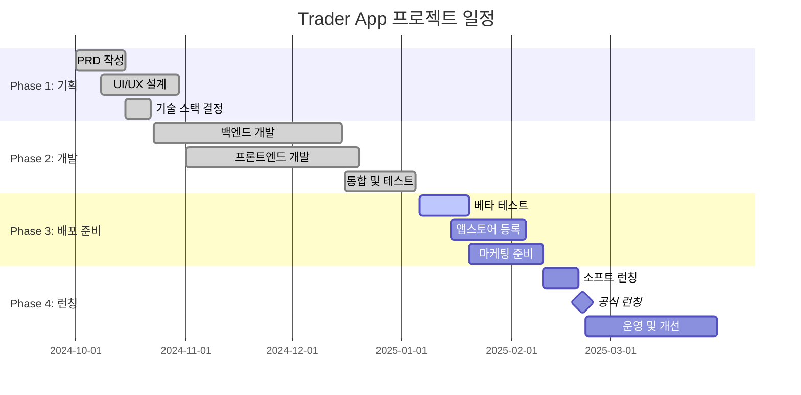

# 📅 Trader App 프로젝트 일정표

## 프로젝트 개요
- **프로젝트명**: Trader App - AI 기반 주식 추천 애플리케이션
- **프로젝트 기간**: 2024-10-01 ~ 2025-03-31 (6개월)
- **현재 단계**: Phase 3 - 테스트 및 배포 준비
- **작성일**: 2025-01-06

## 📊 전체 프로젝트 타임라인

## 🎯 주요 마일스톤

| 마일스톤 | 예정일 | 상태 | 산출물 | 담당자 |
|----------|--------|------|--------|--------|
| **M1: 프로젝트 착수** | 2024-10-01 | ✅ 완료 | 킥오프 미팅 완료 | PM |
| **M2: 기획 완료** | 2024-10-30 | ✅ 완료 | PRD, 디자인 시스템 | PM, UX/UI |
| **M3: MVP 개발 완료** | 2024-12-20 | ✅ 완료 | 기능 구현 완료 | Frontend, Backend |
| **M4: 통합 테스트 완료** | 2025-01-05 | ✅ 완료 | QA 승인 | QA |
| **M5: 베타 테스트 완료** | 2025-01-20 | 🔄 진행중 | 베타 버전 검증 | 전체 팀 |
| **M6: 앱스토어 승인** | 2025-02-05 | ⏳ 대기중 | 스토어 등록 승인 | DevOps |
| **M7: 소프트 런칭** | 2025-02-10 | ⏳ 대기중 | 제한적 사용자 릴리스 | 전체 팀 |
| **M8: 공식 런칭** | 2025-02-21 | ⏳ 대기중 | 프로덕션 배포 | 전체 팀 |

## 📋 단계별 상세 일정

### Phase 1: 기획 단계 (2024-10-01 ~ 2024-10-30) ✅ 완료

#### 1주차 (2024-10-01 ~ 2024-10-07)
- [x] 프로젝트 킥오프 미팅
- [x] 팀 구성 및 역할 분담
- [x] 프로젝트 차터 작성
- [x] 초기 요구사항 수집

#### 2주차 (2024-10-08 ~ 2024-10-14)
- [x] PRD(제품 요구사항 명세서) 작성
- [x] 사용자 페르소나 정의
- [x] 경쟁사 분석
- [x] 기술 스택 검토

#### 3주차 (2024-10-15 ~ 2024-10-21)
- [x] UI/UX 와이어프레임 설계
- [x] 디자인 시스템 구축
- [x] 데이터베이스 설계
- [x] API 명세서 작성

#### 4주차 (2024-10-22 ~ 2024-10-30)
- [x] 프로토타입 제작
- [x] 사용자 테스트 실시
- [x] 기획 문서 검토 및 승인
- [x] 개발 환경 설정

### Phase 2: 개발 단계 (2024-10-23 ~ 2024-12-20) ✅ 완료

#### Sprint 1 (2024-10-23 ~ 2024-11-05)
- [x] 프로젝트 구조 설정
- [x] 기본 인증 시스템 구현
- [x] 데이터베이스 스키마 구현
- [x] 기본 UI 컴포넌트 개발

#### Sprint 2 (2024-11-06 ~ 2024-11-19)
- [x] 사용자 관리 기능 구현
- [x] 전략별 추천 알고리즘 구현
- [x] 홈 화면 및 전략 상세 화면 개발
- [x] API 통신 모듈 구현

#### Sprint 3 (2024-11-20 ~ 2024-12-03)
- [x] 리스크 관리 도구 구현
- [x] 포지션 관리 화면 개발
- [x] 구독 시스템 구현
- [x] 결제 모듈 통합

#### Sprint 4 (2024-12-04 ~ 2024-12-17)
- [x] 알림 시스템 구현
- [x] 설정 및 프로필 화면 개발
- [x] 성능 최적화
- [x] 보안 강화

#### Sprint 5 (2024-12-18 ~ 2024-12-20)
- [x] 통합 테스트
- [x] 버그 수정
- [x] 코드 리뷰 및 리팩토링
- [x] MVP 기능 검증

### Phase 3: 테스트 및 배포 준비 (2025-01-06 ~ 2025-02-10) 🔄 진행중

#### 1주차 (2025-01-06 ~ 2025-01-12) - 현재 진행중
- [x] 베타 테스트 계획 수립
- [x] TestFlight 및 Play Console 설정
- [ ] 베타 테스터 모집 (목표: 50명)
- [ ] 첫 번째 베타 버전 배포

#### 2주차 (2025-01-13 ~ 2025-01-19)
- [ ] 베타 피드백 수집 및 분석
- [ ] 긴급 버그 수정
- [ ] 성능 모니터링 및 최적화
- [ ] 앱스토어 등록 준비

#### 3주차 (2025-01-20 ~ 2025-01-26)
- [ ] 앱스토어 메타데이터 작성
- [ ] 스크린샷 및 프로모션 이미지 제작
- [ ] 개인정보 처리방침 작성
- [ ] 앱스토어 심사 제출

#### 4주차 (2025-01-27 ~ 2025-02-02)
- [ ] 앱스토어 심사 대응
- [ ] 마케팅 자료 제작
- [ ] 랜딩 페이지 개발
- [ ] 소셜 미디어 계정 준비

#### 5주차 (2025-02-03 ~ 2025-02-10)
- [ ] 런칭 이벤트 기획
- [ ] 프레스 릴리스 준비
- [ ] 고객 지원 시스템 구축
- [ ] 모니터링 시스템 구축

### Phase 4: 런칭 및 운영 (2025-02-10 ~ 2025-03-31) ⏳ 예정

#### 소프트 런칭 (2025-02-10 ~ 2025-02-20)
- [ ] 제한적 사용자 대상 릴리스
- [ ] 실시간 모니터링
- [ ] 사용자 피드백 수집
- [ ] 성능 및 안정성 검증

#### 공식 런칭 (2025-02-21)
- [ ] 전면 서비스 오픈
- [ ] 마케팅 캠페인 시작
- [ ] 미디어 홍보
- [ ] 사용자 온보딩 지원

#### 운영 및 개선 (2025-02-22 ~ 2025-03-31)
- [ ] 사용자 피드백 기반 개선
- [ ] 추가 기능 개발
- [ ] 사용자 증가에 따른 확장
- [ ] 프로젝트 회고 및 정리

## 📈 릴리스 계획

### v1.0.0 - MVP 런칭 (2025-02-21)
**핵심 기능**
- 3가지 전설적 트레이더 전략 (제시 리버모어, 래리 윌리엄스, 스탠 와인스타인)
- 기본 리스크 관리 도구
- 구독 시스템 (Basic, Premium, Professional)
- 사용자 인증 및 프로필 관리

### v1.1.0 - 첫 번째 업데이트 (2025-03-15)
**추가 기능**
- 추가 기술적 지표 통합
- 포트폴리오 추적 기능
- 알림 설정 개선
- 성능 최적화

### v1.2.0 - 사용자 경험 개선 (2025-04-15)
**개선 사항**
- 소셜 기능 (트레이더 팔로우)
- 백테스트 도구 (Professional 플랜)
- 다크 모드 지원
- 접근성 개선

### v2.0.0 - 메이저 업데이트 (2025-06-01)
**새로운 기능**
- AI 기반 개인화 추천
- 추가 트레이더 전략
- 다국어 지원
- 해외 주식 지원

## 👥 팀별 작업 일정

### Product Manager
- **완료**: PRD 작성, 요구사항 정의
- **진행중**: 베타 테스트 관리, 마케팅 전략 수립
- **예정**: 런칭 후 제품 로드맵 관리

### UX/UI Designer
- **완료**: 디자인 시스템, 전체 화면 설계
- **진행중**: 마케팅 자료 디자인
- **예정**: 사용자 피드백 기반 UI 개선

### Frontend Developer
- **완료**: Flutter 앱 개발, 모든 화면 구현
- **진행중**: 베타 피드백 반영, 성능 최적화
- **예정**: 추가 기능 개발, 유지보수

### Backend Developer
- **완료**: API 개발, 데이터베이스 구축
- **진행중**: 확장성 개선, 모니터링 시스템
- **예정**: 추가 API 개발, 성능 튜닝

### DevOps Engineer
- **완료**: CI/CD 파이프라인, 빌드 환경
- **진행중**: 앱스토어 배포 준비
- **예정**: 프로덕션 인프라 관리, 모니터링

### QA Engineer
- **완료**: 테스트 계획, 통합 테스트
- **진행중**: 베타 테스트 관리
- **예정**: 프로덕션 품질 관리, 회귀 테스트

### Technical Writer
- **완료**: 사용자 문서, 개발자 문서
- **진행중**: 마케팅 콘텐츠 작성
- **예정**: 사용자 가이드 업데이트, 도움말 개선

## ⚠️ 리스크 및 의존성

### 외부 의존성
| 의존성 | 예상 소요 시간 | 리스크 수준 | 대응 방안 |
|--------|----------------|-------------|-----------|
| 앱스토어 심사 | 1-2주 | 중간 | 충분한 버퍼 기간 확보 |
| 실시간 데이터 API | 1주 | 낮음 | 대체 API 준비 |
| 결제 시스템 승인 | 3-5일 | 낮음 | 사전 검토 완료 |

### 내부 리스크
| 리스크 | 영향도 | 대응 방안 |
|--------|--------|-----------|
| 베타 테스트 지연 | 중간 | 내부 테스트 강화 |
| 성능 이슈 발견 | 높음 | 사전 부하 테스트 실시 |
| 보안 취약점 | 높음 | 정기적 보안 감사 |

## 📊 성공 지표 (KPI)

### 개발 지표
- **코드 품질**: 커버리지 > 80%, 버그 < 1%
- **성능**: 앱 로딩 시간 < 2초, API 응답 < 500ms
- **릴리스**: 계획 대비 일정 준수율 > 95%

### 비즈니스 지표
- **베타 테스트**: 사용자 만족도 > 4.0/5.0
- **앱스토어**: 첫 주 다운로드 > 1,000회
- **수익**: 첫 달 구독 전환율 > 3%

## 📝 버전 관리

### Git 브랜치 전략
- `main`: 프로덕션 배포용
- `develop`: 개발 통합 브랜치
- `feature/*`: 기능별 개발 브랜치
- `release/*`: 릴리스 준비 브랜치
- `hotfix/*`: 긴급 수정 브랜치

### 릴리스 태그
- `v1.0.0-beta.1`: 첫 번째 베타 버전
- `v1.0.0-rc.1`: 릴리스 후보 버전
- `v1.0.0`: 공식 릴리스

---

**작성자**: Project Manager RP  
**검토자**: CTO, 전체 팀 리드  
**다음 업데이트**: 2025-01-13 (주간 진행 상황 반영)